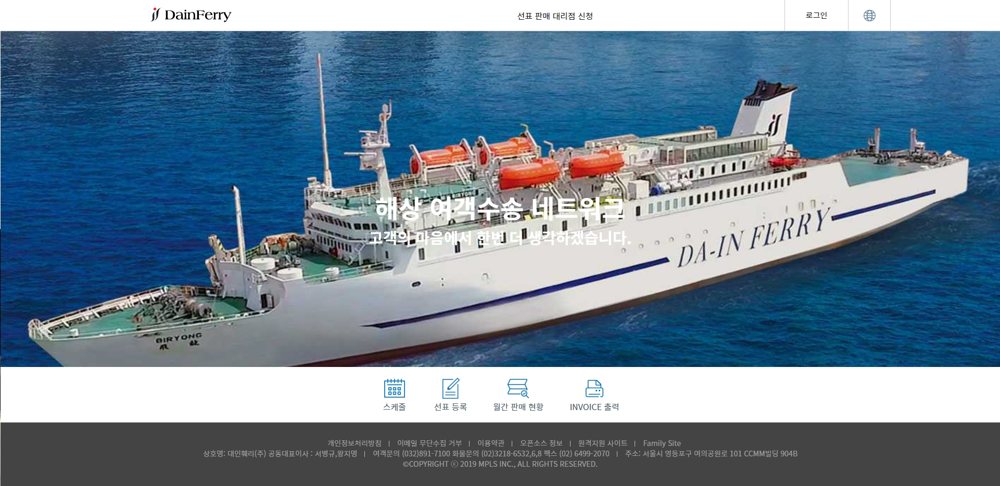
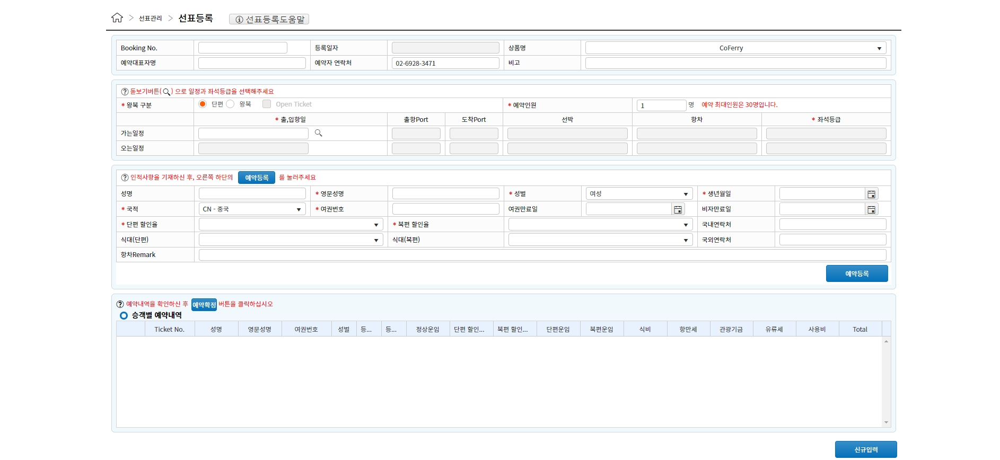

# portfolio
포트폴리오

1. DAINFERRY https://agent.dainferry.co.kr

 1-1 spring framework
 1-2 kendoUI
 1-3 spring-security
 1-4 aop-Transactional
 1-5 jasperReport

 ##kendo Ui Grid 작업 
  

$("#grid").kendoGrid({
                dataSource: {
                    type: "json",
                    transport: {
                        read: data 읽어올 url
                    },
                    pageSize: 20
                },
                height: 550,
                groupable: true,
                sortable: true,
                pageable: {
                    refresh: true,
                    pageSizes: true,
                    buttonCount: 5
                },
                columns: [{
                    template: "

" +
                    "
#: ContactName #
",
                    field: "ContactName",
                    title: "Contact Name",
                    width: 240
                }, {
                    field: "ContactTitle",
                    title: "Contact Title"
                }, {
                    field: "CompanyName",
                    title: "Company Name"
                }, {
                    field: "Country",
                    width: 150
                }]
            });
 ##예약화면    

