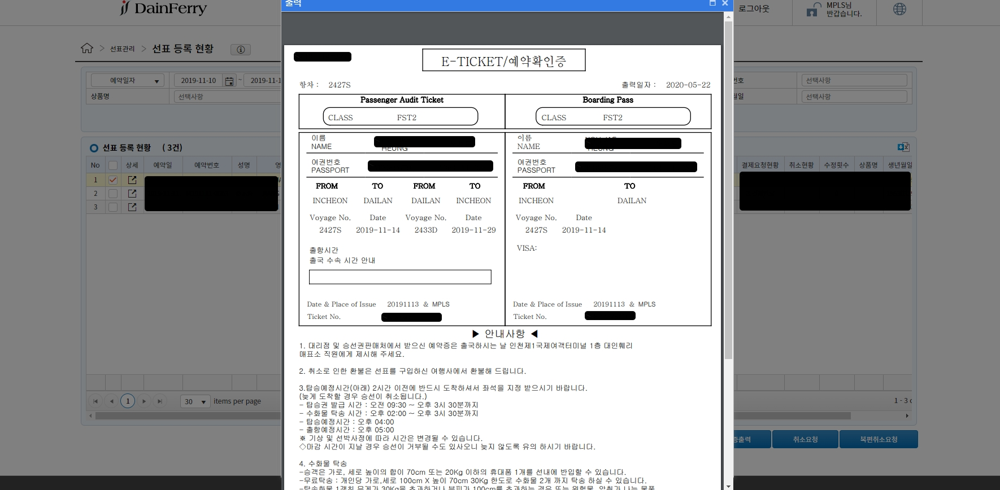
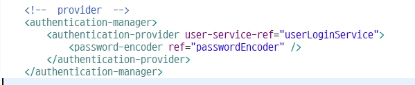
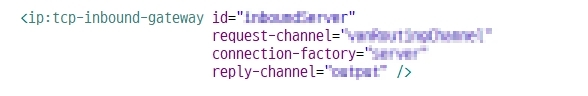
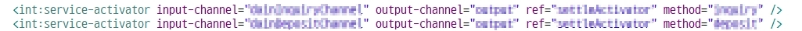

# portfolio
포트폴리오


1. DAINFERRY https://agent.dainferry.co.kr
```
spring framework
kendoUI
spring-security
aop-Transactional
jasperReport
```


kendo Grid 작업 


kendo scheduler


예약화면    


jasper Report 출력물


spring-security

```
url intercept
```

```
login , logout
```

```
userService 구현
password 암호화 sha256사용
```


```
'aop 트랜잭션'
select 제외 service 부분에서 자동 처리되도록 설정
```


2. spring integration 세틀뱅크 전문시스템
``` 
ip:tcp-connection-factory
service factory
serializer, deserializer ( 직렬화 , 역직렬화 )
encoding message : euc-kr,  project : utf-8
```
```
ip:tcp-connection-factory

흐름
server-factory 생성 -> client msg 송신 -> gateway -> message 역직렬화 -> channelRouter(채널분기)-> channel -> serviceActivator(로직구현)
-> outchannel -> 직렬화 송신
```




```
serializer, deserializer ( 직렬화 , 역직렬화 )
seed 암호화 , base64Encoding
```


